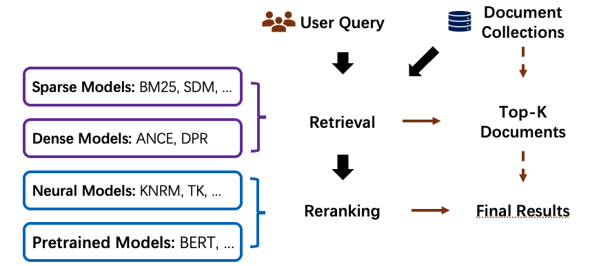
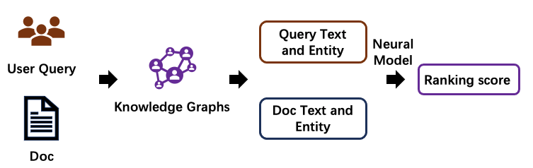
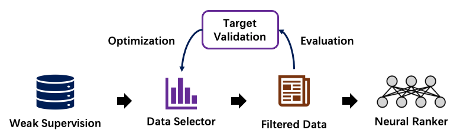

Introduction
===============
OpenMatch (https://github.com/thunlp/OpenMatch) is an open-source and extensible library that provides a unified framework to implement information retrieval (IR) models.

IR Pipelines
-----------------

Information Retrieval (IR) usually employs a two-step pipeline to retrieve documents from a large-scale document collection. OpenMatch provides several pre-defined modules and helps users build an effective IR system with retrieval and reranking steps. 

In the retrieval stage, we can use **sparse retrieval models** or **dense retrieval models** to retrieve candidate documents from a large-scale document collection. Then, in the reranking stage, we can use more sophisticated **Neural IR models** to rerank the retrieved document candidates to achieve better ranking performance.

**Sparse Retrieval** is defined as a sparse bag-of-words retrieval model. These models match terms or phrases of queries and documents with exact matches.

**Dense Retrieval** conducts retrieval by encoding documents and queries
into low-dimensional dense vectors. Then dense retrieval models effectively retrieve the candidate documents that are nearest to the query embedding. They usually use `Faiss <https://github.com/facebookresearch/faiss>`__, a library for efficient similarity search and clustering of dense vectors, uring retrieval. Dense retrieval models are also representation-based Neural IR models and they usually use the pre-trained language models to encode both queries and documents.

**Neural IR Models** uses neural networks as rankers to rerank documents. Neural Information Retrieval (Neu-IR) models leverage neural networks to conduct semantic matches and can be categorized as representation-based ones and interaction-based ones. Representation-based methods encode the representation of query and document separately into two distributed representations. Interaction-based methods model the fine-grained interactions between query and documents, often by the translation matrices between all query and document term pairs. The interaction-based Neu-IR models are usually used in the reranking stage. Recently, the pre-trained language models are also widely used to implement pre-trained IR models, which are also interaction-based ones.

OpenMatch Solutions
---------------------
OpenMatch first inherits `Anserini <https://github.com/castorini/anserini>`__ and `ANCE <https://github.com/microsoft/ANCE>`__ to build the document index for sparse retrieval and dense retrieval to efficiently search candidate documents from a large-scale document collection.

Then OpenMatch provides the following models to calculate ranking features for reranking and IR baseline implementation.

+-------------------+-----------------------------------------------------------------------------------------------+
| Components        | Models                                                                                        |
+===================+===============================================================================================+
| Sparse Retriever  | Boolean AND/OR, LM, BM25, SDM, TF-IDF, Cosine Similarity, Coordinate match, Dirichlet LM ...  |
+-------------------+-----------------------------------------------------------------------------------------------+
| Dense Retriever   | DPR, ANCE, ConvDR                                                                             |
+-------------------+-----------------------------------------------------------------------------------------------+
| Neural Ranker     | K-NRM, Conv-KNRM, TK, BERT, RoBERTa, ELECTRA ...                                              |
+-------------------+-----------------------------------------------------------------------------------------------+
| LeToR             | Coordinate Ascent, RankNet, LambdaMART, Random Forests ...                                    |
+-------------------+-----------------------------------------------------------------------------------------------+
     
Finally, OpenMatch uses **Feature Ensemble** (Learning to rank, LeToR) to fuse ranking features from ranking models of both retrieval and reranking stages to further improve model performance. We can use `RankLib <https://sourceforge.net/p/lemur/wiki/RankLib/>`__ and `RankSVM <https://www.cs.cornell.edu/people/tj/svm_light/svm_rank.html>`__ toolkits to implement ranking feature ensemble.

Moreover, OpenMatch incorporates advanced IR technologies to guarantee the Neu-IR performance on **few-shot ranking** and **conversational search**.

Few-Shot Ranking
-------------------

Domain Transfer Learning can leverage external knowledge graphs or weak
supervision data to guide and help ranker to overcome data scarcity.

Knowledge Enhanced IR Models
~~~~~~~~~~~~~~~~~~~~~~~~~~~~

Knowledge Enhancement incorporates entity semantics of external
knowledge graphs to enhance neural ranker. The entity semantics come from both structural (knowledge graph) and non-structural knowledge (entity description).

Data Augmentation for Neural IR Models
~~~~~~~~~~~~~~~~~~~~~~~~~~~~~~~~~~~~~~~~~~
Pre-trained language models, such as BERT, conduct significant improvement on natural language tasks. However, for information retrieval, the performance of such pre-trained language models shows less effectiveness. On the contrary, when these models are fine-tuned with user searching logs, e.g. Bing log, their ranking accuracy achieves better. It demonstrates that the relevance supervisions of query and document are the bottleneck of neural information retrieval models.

Data Augmentation leverages weak supervision data to improve the ranking
accuracy in certain areas that lacks large-scale relevance labels, such as the Biomedical domain and legal domain. In this part, OpenMatch provides some reproduced models to **generate weak supervision data** and **select weak supervision data with few labeled data**.

OpenMatch incorporates several advanced training methods to further broaden the advance of Neu-IR models in few-shot ranking scenarios. These few-shot training methods mainly focus on alleviating data scarcity in ranking scenarios by leveraging domain knowledge and data augmentation.

**Weak supervision generation.** The query-document relevance is usually the core of Neu-IR models. Nevertheless, these relevant labels are not easy to get. For example, the massive search log is a privilege and not a commodity, even in search engine companies; Some special areas, such as medicine and minority language, we couldn't even find enough experts for relevant labeling. As a substitute, some weak supervisions, such as the anchor texts and linked web pages on Internet, can serve as weak supervision text relevance labels. Besides, we can also generate queries according to the documents for synthesizing query-document relevance.

**Weak supervision selection/reweighting.** Nevertheless, the pseudo queries can be too general, even not informative at all, or matched with multiple documents.
To solve this problem, we can use some data selection or reweighting methods, such as ReInfoSelect and MetaAdaptRank tries to select weak supervision data during training according to the model performance on the target data.

Conversational Search
-----------------------
With the recent development of information retrieval, information retrieval systems have been seeking more conversational interactions with users to improve user searching experiments. Conversational IR proposes a good way to better satisfying user searching intentions, which further considers previous searching sessions. Thus, how to model the searching history is the core of conversational IR.

A natural direction to tackle this challenge is to rewrite the conversational queries according to the previous searching queries, which helps include necessary information for a standard IR system.
Various approaches have been developed to rewrite queries, including IR-style query expansion/term reweighting, NLP-style coreference resolution, and neural-based query rewriting. OpenMatch reproduces some advanced models in conversational search for users, such as ConvDR.